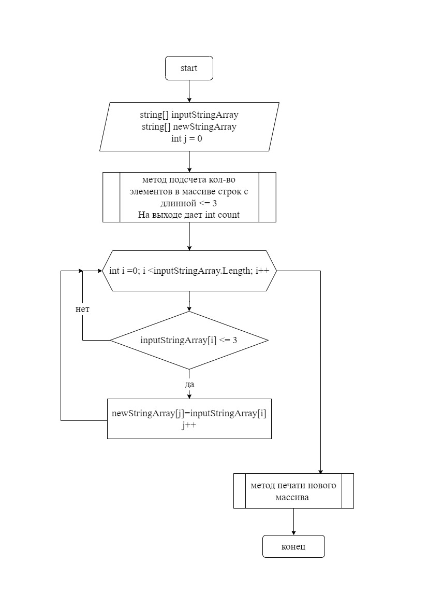

# Итоговая работа № 1

# Задание 
`Написать программу, которая из имеющегося массива строк формирует массив из строк, длина которых меньше, либо равна 3 символам. Нарисовать блок-схему`

## `1. БЛОК СХЕМА`

## `2. ОПИСАНИЕ АЛГОРИТМА ПРОГРАММЫ`

* Алгоритм включает 3 метода: 
    1. Метод подсчтета количества в исходном массиве строк с длинной меньше или равной 3; 
    2. Метод создания нового массива со строками, длина которых меньше или равна 3;
    3. Метод печати массива

* После того, как подсчитали в исходном массиве (inputStringArray) количество строк с длинной меньше или раной 3 (count), создаем новый массив с длинной, равной count (newStringArray). В который записываем строки с длинной меньше или равной 3. 
* Далее печатем новый массив. 

